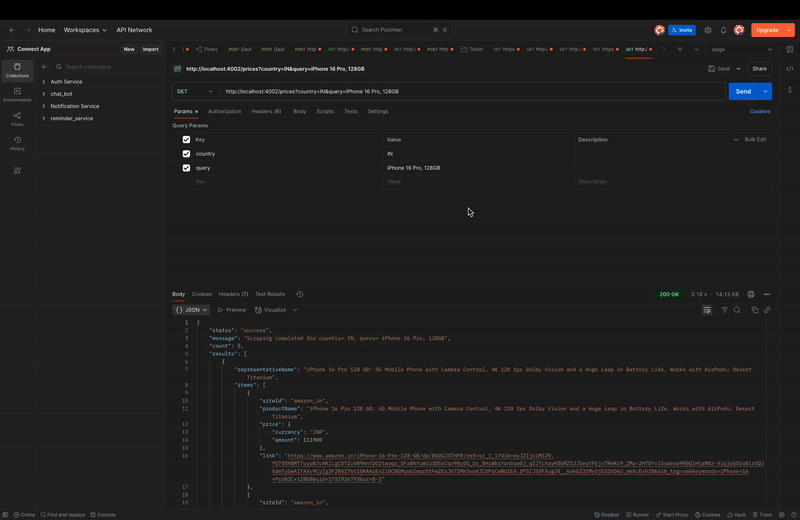

# 📦 Price Scraper API

A scalable, intelligent, multi-threaded product price scraper designed to extract, normalize, and compare data across various e-commerce platforms. Built to be **modular**, **extensible**, and **Docker-ready** for rapid deployment and testing.

---

## ✅ Features

* 🔎 Scrapes product data (title, price, link) from multiple online stores
* ✨ Cleans, normalizes & deduplicates messy HTML content
* 🧠 Fuzzy matcher groups similar products across sites
* 🧵 True parallel scraping using Node.js `worker_threads`
* 📄 Easily extendable via YAML config for new countries/sites
* 🐳 Full Docker support for isolated deployment

---

## 📂 Folder Structure

```
src/
├── config/
│   └── sites.yaml             # Adapter config per site & country
├── scraper/
│   ├── adapterLoader.js       # Loads config from YAML
│   ├── scraperEngine.js       # Scraper logic controller
│   └── scraperWorker.js       # Multi-threaded scraping logic
├── aggregator/
│   ├── aggregator.js          # Deduplicates and groups results
│   └── matcher.js             # Fuzzy matching across product names
├── utils/
│   └── normalizeUtils.js      # Normalizes product names, prices, and links
├── api/
│   └── index.js               # Route handler for /prices
└── server.js                  # Express app entry point
```

---

## 🧰 Tech Stack

- **Node.js (v18+)** – JavaScript runtime environment
- **Express.js** – Lightweight HTTP server for API handling
- **Playwright** – Headless browser automation for web scraping (Chromium-based)
- **Cheerio** – jQuery-like HTML parsing for scraping DOM elements
- **Worker Threads (Node.js)** – Parallel scraping using multithreaded architecture
- **YAML** – Configurable scraping rules per site and country (`sites.yaml`)
- **Docker** – Containerized deployment and isolated runtime
- **Dotenv** – Environment variable management
- **ESM (ECMAScript Modules)** – Modern module system with `import/export` syntax
- **Regex** – Used for normalization and fuzzy matching


---


## 🌍 sites.yaml Structure

```yaml
IN:
  amazon_in:
    url: "https://www.amazon.in/s?k={{query}}"
    selectors:
      item: "div.s-result-item"
      title: "h2 > a > span"
      price: ".a-price > .a-offscreen"
      link: "h2 > a"
  flipkart:
    url: "https://www.flipkart.com/search?q={{query}}"
    selectors:
      item: "._1AtVbE"
      title: "._4rR01T"
      price: "._30jeq3"
      link: "a._1fQZEK"
```

---

## 🧠 Flow Summary

```
GET /prices?country=IN&query=some_product
     ↓
Load site config (sites.yaml)
     ↓
Spawn parallel worker threads for each site
     ↓
Scrape product listings using Playwright + Cheerio
     ↓
Normalize price, product name, and links
     ↓
Aggregate and group similar listings (fuzzy match)
     ↓
Return unified list of products
```

---

## 🚀 Local Development

### Install dependencies & Playwright browsers

```bash
npm install
npx playwright install
```

### Run locally

```bash
npm start
```

API available at: `http://localhost:4002`

---

## 🐳 Docker Deployment

### Build the Docker image

```bash
docker build -t price-scraper-app .
```

### Run the container

```bash
docker run -d -p 4002:4002 --name price-scraper-app price-scraper-app
```

### View logs

```bash
docker logs -f price-scraper-app
```

---

## 🔀 API Usage

### Endpoint

```
GET http://localhost:4002/prices?country=IN&query=Borosil Nutrifresh PB31
```

### Sample Output

```json
{
  "status": "success",
  "message": "Scraping completed",
  "count": 3,
  "data": [
    {
      "siteId": "flipkart",
      "productName": "Borosil Nutrifresh PB31",
      "price": "₹2,399",
      "link": "https://flipkart.com/..."
    }
  ]
}
```

---


## 🌍 Live API Endpoint (Render)

> 🔄 **Hosted on Render (Free Instance)**  
> ⚠️ Scraping may be **slower** due to resource limits.  
> 💡 For best performance, run **locally** with Playwright and headless Chromium.

### 🔍 Sample Request

```bash
curl --location 'https://price-scraper-ny7v.onrender.com/prices?country=IN&query=boAt%20Airdopes%20311%20Pro'

```
---

## 📊 Future Improvements (Planned by Aniket)

| Area                          | Description                                                               |
| ----------------------------- | ------------------------------------------------------------------------- |
| 🧵 **Thread Pool Management** | Reuse worker threads using a pool for better scalability and efficiency   |
| ⚖️ **Queueing System**        | Add job queue (e.g., Bull/RabbitMQ) to queue and prioritize scraping jobs |
| 📢 **Async Task API**         | Convert /prices endpoint to async with taskId/resultId pattern            |
| ⟳ **Retry & Backoff**         | Retry scraping with exponential backoff on network/timeouts               |
| 🧠 **Smart Matching**         | Use GPT-based or cosine similarity matching for accurate comparison       |
| 🌐 **Country Modularity**     | Improve config schema to support nested & validated multi-country setup   |
| ✅ **Test Coverage**           | Add unit/integration tests with Jest or Vitest                            |
| 🏛 **Caching Layer**          | Redis/memory cache to store frequent queries and avoid re-scraping        |
| 📊 **Dashboard / Logs**       | Add UI/CLI to monitor scrape status, thread health, logs                  |
| ⚡ **Rate Limiting**           | Prevent IP bans by per-domain throttle and concurrency control            |

---



---
## 👨‍💻 Author

Made with ❤️ by **AniketVS**
